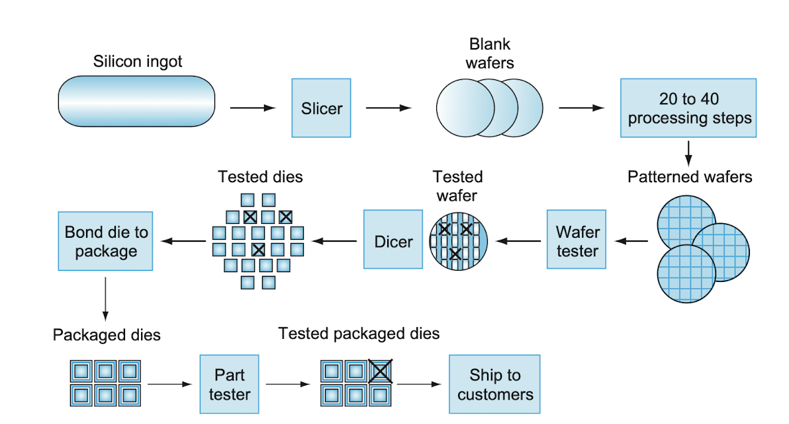

# RISC-V架构学习笔记

## 目录

- [RISC-V架构学习笔记](#risc-v架构学习笔记)
  - [目录](#目录)
  - [Computer Abstractions and Technology](#computer-abstractions-and-technology)
    - [Eight Great Ideas in Computer Architecture](#eight-great-ideas-in-computer-architecture)
    - [Technologies for Building Rpocessors and Memory](#technologies-for-building-rpocessors-and-memory)
    - [Performance](#performance)
      - [Measuring Performance](#measuring-performance)
      - [CPU性能及其度量因素](#cpu性能及其度量因素)
      - [指令性能](#指令性能)
      - [经典的CPU性能公式](#经典的cpu性能公式)
    - [从单处理器到多处理器](#从单处理器到多处理器)
      - [评测CPU性能](#评测cpu性能)
    - [谬误与陷阱](#谬误与陷阱)
  - [Instruction:Language of the computer](#instructionlanguage-of-the-computer)
    - [计算机硬件的操作](#计算机硬件的操作)
    - [计算机硬件的操作数](#计算机硬件的操作数)
      - [存储器操作数](#存储器操作数)
      - [常数/立即数操作数](#常数立即数操作数)
    - [有符号数和无符号数](#有符号数和无符号数)
    - [计算机中的指令表示](#计算机中的指令表示)
      - [RISC-V指令字段](#risc-v指令字段)
    - [逻辑操作](#逻辑操作)
    - [用于决策的指令](#用于决策的指令)
      - [数组边界检查的简便方法](#数组边界检查的简便方法)
      - [case/switch语句](#caseswitch语句)

## Computer Abstractions and Technology

### Eight Great Ideas in Computer Architecture

- Design for Moore's law

### Technologies for Building Rpocessors and Memory

芯片从制造到用户的过程



良率(yield):合格芯片数占总芯片数的百分比，上述的第五步

### Performance

- 响应时间(execution time):计算机完成某个任务所需要的总时间，包括硬盘访问，内存访问，I/O活动，操作系统开销，CPU执行时间等
- 吞吐率，也叫带宽(bandwidth):单位时间内能完成的任务数量

> 个人用户通常对响应时间更感兴趣，数据中心对管理者感兴趣的通常是吞吐率

> 并不是说改善响应时间就一定会改善吞吐率，比如某个任务需要的总时间减少了，但是可能是计算机将更多的资源分配给了这个任务，从而导致了实际上吞吐率的下降，反之亦然

前几章测量性能的时候主要考虑的是响应时间，对于某个计算机X我们可以有如下的性能计算公式

$$Performance_X = \frac{1}{Execution\ time_X}$$

#### Measuring Performance

时间是计算机性能的衡量标准：完成同样的计算任务，需要时间最少的计算机是最快的.但时间也有不同的定义方法，最直接的定义叫做挂钟时间`Wall clock time`，又叫响应时间`response time`，运行时间`elapsed time`等

- CPU执行时间：执行某一任务在CPU上所花费的时间，不包括I/O等待或运行其他程序的时间

CPU时间还可以进一步分为用于用户程序的时间和操作系统为用户程序执行相关程序所花去的CPU时间，前者被称为**用户CPU时间**，后者称为**系统CPU时间**

- 系统性能：本书中表示空载系统的响应时间
- CPU性能：本书中表示用户CPU时间

#### CPU性能及其度量因素

$$CPU\ execution\ time = CPU\ clock\ cycles\ for\ a\ program\ \times\ Clock\ cycle\ time$$

硬件设计者为了减少程序执行所需的CPU时钟周期数或缩短时钟周期长度，就能改进性能.但我们时常需要面对这两者的抉择，许多技术在减少程序CPU时钟周期数时会增加时钟周期长度

#### 指令性能

对于一个程序而言，编译器生成了明确的指令，且计算机必须通过指令来运行程序，因此执行时间依赖于程序中的指令数

一种考虑方法为

$$CPU\ clock\ cycles = Instructions\ for\ a\ program \times Average\ clock\ cycles\ per\ instruction$$

然后再结合前面的**CPU性能公式**

指令平均时钟周期数(clock cycle per instruction)：表示执行每条指令所需的时钟周期平均数，缩写为`CPI`

#### 经典的CPU性能公式

$$CPU\ execution\ time = CPI\ \times Instruction\ count \times Clock\ cycle\ time$$

**理解程序性能**：程序的性能与算法、编程语言、编译器、体系结构以及实际的硬件有关


有些处理器在每个时钟周期可以取多条指令并执行，有些设计者用IPC来代替指令平均执行周期数CPI，如一个处理器每个时钟周期可以处理2条指令，那么它的IPC为2，CPI为0.5

时钟周期长度一般而言是固定的，但是为了节省能量/暂时提升性能，今天的计算机可以使用不同的时钟频率，因此我们对程序需要使用**平均时钟频率**(锁频和超频)

现代集成电路技术中占主导地位的是CMOS(互补型金属氧化半导体)，其主要的能耗来源是动态能耗，即在晶体管开关过程中产生的能耗，即晶体管的状态从0到1，从1到0的过程消耗的能量

动态能耗取决于每个晶体管的负载电压和工作电压

$$Energy\varpropto Capacitive\ \times load Voltage^2$$

这个式子表示的是一次$0\to 1\to 0$或是$1\to 0\to 1$的逻辑转换消耗的能量

一个晶体管消耗的能量

$$Energy\varpropto \frac{1}{2} \times Capacitive\ \times load Voltage^2$$

那么每个晶体管的功耗为

$$Power\varpropto \frac{1}{2}\times Capacitive\ \times load Voltage^2 \times Frequency\ switched$$

其中，开关频率是时钟频率的函数，负载电容是连接到输出上的晶体管数量(称为扇出fanout)和工艺的函数.每次工艺更新换代时都会降低电压，从而达到大幅度减少功率和能耗

但电压是不能一直下降的，电压的下降会导致晶体管的泄漏电流过大，目前40%的功耗都是由于泄漏电流造成的

> CMOS的主要功耗来自于动态能耗，但是静态能耗也是存在的，及时在晶体管关闭的情况下，也有泄漏电流存在.在服务器中，典型的泄漏电流占40%的能耗

### 从单处理器到多处理器

为了减少处理器(processor)和微处理器(microprocessor)之间的语义之间的混淆，一些公司将处理器作为核(core)的代称，在这种语境下，微处理器(microprocessor)就是多核处理器

显式并行程序的编写困难的原因
- 并行程序以提高性能为目的，这必然增加编程的难度
- 为了充分发挥并行硬件的速度，程序员必须将应用划分为每个core上有大致相同数量的任务，并同时完成.与此同时还需要减少调度的开销，不浪费并行的性能

#### 评测CPU性能

为什么SPEC要用几何平均值?
    这更公平，能够让一个坏的结果不是简单的被一个好的结果所抵消，且它受极端值的影响较小

### 谬误与陷阱

以下为正确的叙述

- 1.改进计算机的某个方面总性能的提高与改进大小不成正比
  考虑Amdahl定律

- 2.低利用率的计算机其功耗的降低不一定是显著的

- 3.不要用性能公式的部分方面去度量性能

- 4.面向性能的设计与面向能效的设计具有相关的目标
  能耗是功率和时间的乘积，即使我们为了提高性能而增大了功率，但因此也减少了时间，所以有可能能耗其实是减少的

## Instruction:Language of the computer

- 指令：计算机的词汇
- 指令系统：计算机的词汇表
- 存储程序概念：指令与多种类型的数据不加区别的存储在存储器中并因此易于更改，因此产生了存储程序计算机

> 操作数(operand):指的是在某个操作中设计的数据.当处理器执行一个指令的时候，它会根据这个指令的功能以及指定的操作数来进行对应的运算，在RISC-V中操作数可以指
>   - 32个寄存器
>   - $2^{61}$个存储字(注意RISC-V使用字节寻址，因此顺序双字访问相差8)
>   - 立即数

### 计算机硬件的操作

硬件设计三条基本原则第一条：
**简单源于规整**
*“操作数数量可变的硬件比固定数量的硬件更复杂”*


> 为了提高可移植性，Java最初被设计为依赖于软件的解释器.这个解释器的指令系统称为**Java bytecode**，它与RISC-V有很大的不同.为了使性能接近于等效的C程序，现在的Java系统通常会将**Java bytecode**编译为像RISC-V这样的机器指令

### 计算机硬件的操作数

算数指令的操作数会受到限制，它们必须取自寄存器，而寄存器的数量是有限且内建于硬件的特殊位置的.在RISC-V的体系中，寄存器的大小为64位；成组的64位频繁出现，因此它们在RISC-V体系结构中被命名为**双字**.另一个常见大小是成组的32位，在RISC-V体系结构中被命名为**字**.

RISC-V算数指令的三个操作数必须从32个64位寄存器中选择，之所以将RISC-V体系中的寄存器个数限制为32个，是因为：

硬件设计三条基本原则第二条：
**更少即更快**
*“数量过多的寄存器可能会增加时钟周期，因为电信号传播的距离越远，所花费的时间就越长”*

> 更少即更快的原则并不是绝对的，设计人员必须要在程序对更多寄存器的渴求以及设计人员对缩短时钟周期的期望之间取得平衡

另一个不使用超过32个寄存器的理由：

todo!()

尽管我们可以使用寄存器0～31来编写指令，但是RISC-V规定在"x"后面跟一个寄存器编号来表示，具体来说：
```asm
add x5, x6, x7
```
而不是
```asm
add 5, 6, 7
```

> 我猜这可能是为了与立即数不引起混淆？

#### 存储器操作数

复杂的数据结构可以包含比计算机中寄存器数量更多的数据元素，这种复杂的数据结构或是数组可以存放在内存中

由于RISC-V指令中的算数运算只作用在寄存器上面而不作用在内存上，因此我们需要**数据传输指令**用于在内存和寄存器之间传输数据.而由于内存之中数据排列的线性性，内存不过是一个很大的一维数组，内存地址作为数组的下标，从0开始.

将数据从内存复制到寄存器中的数据传输指令通常被称为载入指令`load`，载入指令的格式是操作名称后面跟着**等待数据载入的寄存器**，然后是**另外一个寄存器和偏移量**，表示内存地址为该寄存器中的内容加上偏移量，例如，在RISC-V汇编语言中，取双字的指令为`ld`

```asm
ld x5, 16(x6)
```
这个就表示将`Mem[x6 + 16]`的内容放入`x5`中，存放基址的寄存器(`x6`)一般称为基址寄存器

计算机分为两种
- 大端编址
- 小端编址

比如以一个32位的整数为例:0x12345678

- 大端编址
  | 内存地址 | n | n+8 | n+16 | n+24 |
  | ------ | --- | --- | --- | --- |
  | 字节值 | 0x12 | 0x34 | 0x56 | 0x78 |

- 小端编址
    | 内存地址 | n | n+8 | n+16 | n+24 |
  | ------ | --- | --- | --- | --- |
  | 字节值 | 0x78 | 0x56 | 0x34 | 0x12 |

与`load`指令相反的指令为`store`指令，它将寄存器复制数据到内存，格式与`load`指令类似，在RISC-V指令集中，存储双字的指令为`sd`

> **对齐限制**：在许多的体系结构中，字的起始地址必须是4的倍数，双字的起始地址必须是8的倍数，该要求被称为是对齐限制.

RISC-V与Intel x86中没有对齐限制，但是MIPS中有这个限制

**硬件/软件接口**：加载和存储指令的地址是二进制数，因此作为主存的DRAM以二进制而不是十进制来表示容量的大小

#### 常数/立即数操作数

程序经常会在一次操作中使用到常数，例如递增数组下标以指向数组的下一个元素，但如果使用在之前介绍到的指令，我们只能够将这种常数存放在内存中，使用的时候将其拿出.由于常数使用的频繁性以及加载指令通常是缓慢的，我们提供了另外一种版本的指令，它的其中一个操作数是一个常数

此外常数0有另一个作用，通过有效使用它可以简化指令系统体系结构，例如要求一个数的相反数，我们可以直接
```asm
sub x1, 0, x1
```
由于0的使用的频繁性，通常我们会将`x0`寄存器硬连线到常数0，这意味着`x0`中的内容恒为0，这种根据使用频率来确定要定义的常数，是**加速经常性事件**重要思想的体现

> C99标准中，用作数组下标的变量类型为`size_t`

> 本书中RISC-V的寄存器为64位宽，但也存在32位宽的RV32的变体，这种架构具有32位的寄存器，成本降低的RV32能够更好地适用于低成本处理器

### 有符号数和无符号数

计算机需要一种办法来区分正数与负数，以下是历史的发展过程：

- 1. **增加一个单独的符号位(原码)**
  困难：
    - 在哪里放置符号位不明确
    - 由于在计算完成之前无法知道符号是什么，这种加法器可能需要额外的步骤来设置符号
    - 在这种表示下，即存在`+0`又存在`-0`


- 2. **简化硬件的表示方法(前导0表示正数，前导1表示负数)(二进制补码)**
  困难：
    - 最小的那个负数没有对应的正数

> 但它已经足够好了:D

当需要将一个数从内存中载入寄存器的时候，有两种载入方式

- 无符号载入
  - 将这个数视为无符号数，并在数的左边直接填充0
  - RISC-V中的相应命令为`ldu`
- 有符号载入
  - 将这个数视为有符号数，并在数的左边填充符号位
  - RISC-V中的相应命令为`ld`

当我们需要将一个64位的数载入一个64位的寄存器中，上述讨论填充的步骤是没有意义的.

在C语言编程中，由于我们一般而言都是使用字节来表示字符(一个`char`类型占一个字节)而不是将字节视为有符号类型的短整数，因此在使用C语言编程的时候，编译器会将`lbu`视为字节载入的命令

> 这并不意味着RISC-V仅仅支持这一种字节载入的方式

使用二进制补码时的快捷方式
   - 求一个数的相反数只需要将该数按位取反再加一即可
      - 这个观察来自于一个数`x`与其按位取反的数`x'`相加的结果一定位`11...1`，这即为`-1`，也就是说`x + x' + 1 = 0`，那么于是`x' + 1 = -x`

> 除了原码/二进制补码，历史上还诞生过一种叫做反码的表示方法，它试图用于取代原码

- 反码：将一个二进制数按位取反得到其相反数
  困难：
    - `11...1`表示`-0`而`00...0`表示`+0`
    - 若考虑一个数`x`以及其相反数`x'`，在无符号的意义下，`x'= (1 << n) - x - 1 `而二进制补码只需要`x' = (1 << n) - x`，相比之下反码取相反数这个操作还需要加法器多做一个步骤去`-1`

> 在讨论浮点类型的时候，我们用的叫做偏移表示法(biased notation):浮点数以`00...0`表示**最小负数**，用`11...1`表示**最大正数**，而用`10...0`表示`0`

### 计算机中的指令表示

人们使用计算机指令的方式和计算机识别指令的方式是不一样的，指令以一系列的电平信号的形式存储在计算机中，并以数字的形式表示.实际上，每条指令的各个部分都可以**被视为一个单独的数**，把这些数字拼在一起就成了一条指令

举例：
```asm
add x9, x20, x21  // 将其翻译为下面的指令的数字表示形式
0000000 10101 10100 000 01001 0110011
```
我们将这种**指令的数字表示**称为**机器语言**，根据**简单源于规整**的硬件设计原则，RISC-V中的所有指令都是32位的，我们将这样的数字表示的**指令序列**称为**机器码**

#### RISC-V指令字段

| funct7 | rs2 | rs1 | funct3 | rd | opcode |
| ------ | --- | --- | ------ | -- | ------ |
| 7 bits | 5 bits| 5bits | 3 bits | 5 bits | 7 bits |

以下为RISC-V指令的各个字段的含义：
1. `opcode`：表示指令的基本操作
2. `funct3`：表示一个另外的操作码字段
3. `funct7`：表示一个另外的操作码字段
4. `rd`：目的操作数寄存器，用于存放运算后得到的结果
5. `rs1`：第一个源操作数寄存器
6. `rs2`：第二个源操作数寄存器

当指令需要比上面显示的更长的字段的时候就会出现问题，例如我们需要一个立即数加，考虑如下的汇编指令

```asm
add x1, x2, 60
```

这时候我们期望在`rs2`字段中保存一个`60`大小的常数，但`rs2`字段只有5位，最大能表示的常数为`31`，这时候在所有指令保持相同长度的需求与保持单一指令的格式的需求之间发生了矛盾，引导我们最终的设计原则：

硬件设计三条基本原则第三条：
**优秀的设计需要适当的折中**

RISC-V的设计人员选择的折中方案是，所有的指令长度保持一致，均为32位，对于不同的指令使用不同的指令格式，上述对寄存器的指令格式称为**R型**，对常数操作的指令/加载指令称为**I型**，指令格式如下

| immediate | rs1 | funct3 | rd | opcode |
| ------ | --- | ------ | -- | ------ |
| 12 bits | 5bits | 3 bits | 5 bits | 7 bits |

其中`immediate`字段使用的是二进制补码的方式，因此它可以表示$-2^{11}-2^{11}-1$这些数字，当I型指令格式用于加载指令的时候，其基地址的偏移量可以取$-2^{11}-2^{11}-1$这些

> 在这些指令格式下面，当我们需要扩充寄存器数量的时候，必须要重新设计指令格式，`rs1`和`rd`不够用了

除了`R`型指令和`I`型指令，我们还需要一种指令格式来存储双字指令`sd`的指令格式，它需要两个源寄存器和一个用于地址偏移量的`immediate`字段，这种指令格式称为**S型**，其指令格式如下

| immediate[11:5] | rs2 | rs1 | funct3 | immediate[4:0] | opcode |
| ------ | --- | --- | ------ | -- | ------ |
| 7 bits | 5 bits| 5bits | 3 bits | 5 bits | 7 bits |

举例：

```asm
sd x5, 40(x6)
```

注意目标操作数寄存器是`rs2`，源寄存器是`rs1`

那么这条指令被翻译成

| immediate[11:5] | rs2 | rs1 | funct3 | immediate[4:0] | opcode |
| ------ | --- | --- | ------ | -- | ------ |
| 0000001 | 00101 | 00110 | 011 | 01000 | 0100011 |

指令格式通过`opcode`字段来进行区分

> 在处理常量的时候，RISC-V汇编语言程序员不会被强迫使用`addi`指令，只需要简单的写上`add`指令即可，编译器会根据操作数是否都取自寄存器/一个取自寄存器一个为常数判断需要`R型`还是`I型`的指令

> 尽管RISC-V中有`add`指令和`sub`指令，但是没有与`addi`对应的`subi`指令，这个的原因在于`addi`的指令格式中`immediate`字段是二进制补码的形式

**重点**

当前的计算机的构建基于以下两个原则：
1. 指令由数字形式表示
2. 程序和数据一样保存在存储器中来进行读写

这种精妙的设计采用与处理数据一样的方式来处理指令，极大地简化了存储器硬件与计算机系统软件

### 逻辑操作

最初的时候，计算机只对整字进行操作，后来发现在一个字内对几个位构成的字段进行操作甚至对单个位进行操作是十分有用的

- 右移，这个用`0`填充空出来的位
- 算数右移，这个用符号位来填充空出来的位

移位指令使用**I型**指令格式，在**I型**格式中的`immediate`字段，其中的低6位被实际使用，这是由于我们不会需要在64位寄存器中移动大于63位的内容，高6位被重新用作另外的操作码

在RISC-V的操作中并没有出现`NOT`操作，这是由于设计者希望保存三操作数的指令格式，取而代之的是`XOR`操作，因此对一个数使用`NOT`操作相当于是将这个数与`11...1`做异或操作

> C语言中允许在双字中定义"位字段"/"字段"，它们都允许将对象打包在双字中，并匹配外部强制接口，所有的字段都必须匹配单个双字(这表明单个字段不能超过双字的长度)，字段是无符号类型整数并且可以缩短至1位.

如何分离出单个字段

例:
```asm
使用AND操作: x & 00...011100...0
```

### 用于决策的指令

RISC-V汇编语言包含两个决策类型指令：

1. ```asm
   beq, rs1, rs2, L1
   ```
2. ```asm
   bne, rs1, rs2, L1
   ```
第一条语句表示，如果寄存器`rs1`中的内容等于`rs2`中的内容，则转到`L1`语句执行；第二条语句表示，如果寄存器`rs1`中的内容不等于`rs2`中的内容，则转到`L2`语句执行

这两条语句在RISC-V中通常被称作是**条件分支**语句

**无条件分支**

该指令表示在遇到该指令时，程序必须分支，在RISC-V汇编语言中，表达无条件分支的一种方法是使用条件始终为真的条件分支

```asm
beq x0, x0, Exit
```

一个汇编指令序列的优化例子，考虑以下C程序中的代码以及其对应的汇编代码

```c
  while(save[i] == k)
    i+=1;
```

其中`i`，`k`对应的寄存器分别为`x22`，`x24`，数组的基址保存在`x25`中

```asm
  Loop: slli x10, x22, 3
        add x10, x10, x25
        ld x9, 0(x10)
        bne x9, x24, Exit
        addi x22, x22, 1
        beq x0, x0, Loop
        Exit:
```

> 上面这种以分支结尾的指令序列对于编译而言非常基础，它们有专门的术语：基本块.基本块指的是这样的指令序列：在这个块中，程序只有一个入口点和一个出口点.编译的基础工作之一就是将程序划分为若干个基本块

我们目前所做的事情只是在判断两个数是否相等，但实际情况中我们需要处理更多的情形，包括大于等于、小于等于、小于...此外，位模式的比较还需要处理有符号数和无符号数之间的差别：对于有符号数的情形，最高有效位是`1`自然要小于最高有效位是`0`的数；而对于无符号数的情形，最高有效位是`0`的情况自然要小于最高有效位是`1`的数

> [用最高有效位的双重含义来降低数组边界检查的成本](#数组边界检查的简便方法)

RISC-V提供了指令用于处理上述的两种情况：
1.  `blt`：小于则分支
2.  `bge`：大于等于则分支
3.  `bltu`：无符号数类型的小于则分支
4.  `bgeu`：无符号数类型的大于等于则分支

> 当然也可以不引入上面的这些操作，以下是三种解决方案
> 1. 引入辅助的指令(MIPS)
      MIPS指令集引入了名为`slt`的指令
      ```asm
      slt t0, s1, s2  // t0 = (s1 < s2)? 1 : 0;
      ```
      然后结合`bne`/`beq`指令使用
> 2. 引入额外的bit(ARM)
      ARM指令集使用了额外的位用于存储运算结果
      比如说要比较`r1`与`r2`的结果，我们可以看看`r1 - r2`得到的位，这些额外的位被称为是`条件代码位`/`标志位`，然后用于表示是否发生了溢出/负数等问题

> 使用符号右移的操作是不行的，因为这样你没法处理溢出的问题，(不过也不是不能做，详情见CSAPP) **TODO!**

#### 数组边界检查的简便方法

核心思想：将有符号数当作是无符号数来处理

检查`x20`中的值，如果`x20`中的值大于等于`x11`中的值，或者`x20`中的值小于`0`，则越界

```asm
bgeu x20, x11, IndexOutOfBounds
blt x20, x0, IndexOutOfBounds
```

#### case/switch语句

大多数编程语言都包含`case`/`switch`语句，(`rust`中的`match`语句)，这些语句允许程序员跳转到多个条件分支中的一个，在汇编层面，实现这种语句可以有两种想法：
1.  将`switch`语句翻译成多个`if else`语句然后再处理
2.  一种可能是更高效的情况是，在编码的时候将指令序列形成地址表，这个表称为**分支地址表**或是**分支表**，在RISC-V中，指令无非就是一个双字，因此分支表只不过是一个元素大小一个双字的一维数组，其中包含了与代码中的标签对应的地址.程序只需要将分支表中的内容加载到寄存器中，然后根据提供的指令跳转到相应的地址即可.为了支持这种情况，RISC-V的指令系统中包含一条简洁跳转指令`jalr`，能够无条件的跳转到寄存器中指定的地址

